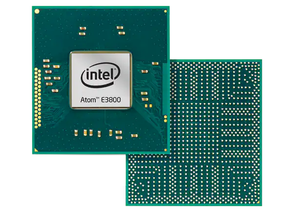
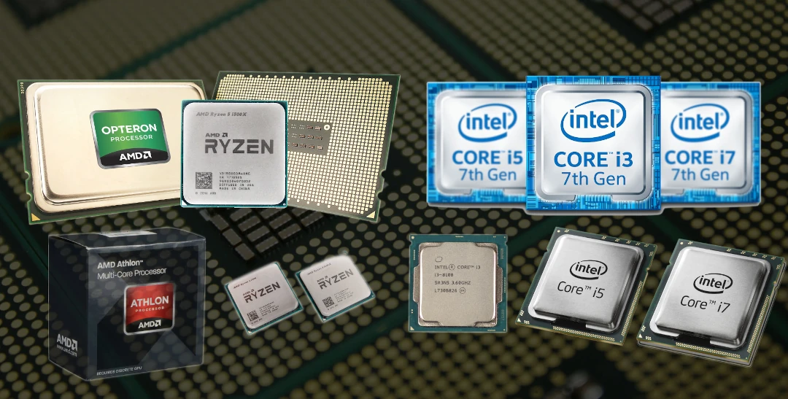

## Trabalho feito por: **Hélio Tavares**, **Bohdan Radchik**, **Frederico Bacar**

## Turma 11ºQ1

# Os principais microprocessadores e inovações da década 00s

**Durante a década de 2000, houve várias inovações significativas no campo dos microprocessadores. Abaixo estão alguns dos principais microprocessadores e inovações dessa década:**

- **Intel Pentium 4 (2000):** Lançado em 2000, o Pentium 4 foi um dos principais produtos da Intel na década de 2000. Ele introduziu a arquitetura NetBurst e foi notável por suas altas frequências de clock em comparação com os processadores da época.

- **AMD Athlon 64 (2003):** Este foi um marco importante, já que introduziu a arquitetura de 64 bits no mercado de consumo em massa. Além disso, a AMD introduziu o conjunto de instruções x86-64, que é amplamente utilizado até hoje.

- **Intel Core 2 Duo (2006):** Esta linha de processadores, baseada na microarquitetura Core, foi um avanço significativo em termos de eficiência energética e desempenho em relação aos predecessores da Intel. O Core 2 Duo estabeleceu a Intel como líder em desempenho de processadores.

- **Multi-Core Processors (início dos anos 2000):** A introdução de processadores multi-core foi uma inovação crucial. Ao invés de um único núcleo de processamento, os fabricantes começaram a incluir dois ou mais núcleos em um único chip, o que melhorou significativamente o desempenho multitarefa.

- **Hyper-Threading (2002):** A Intel introduziu a tecnologia Hyper-Threading nos seus processadores Pentium 4. Essa tecnologia permitiu que um núcleo físico fosse utilizado como dois núcleos lógicos, melhorando a eficiência do processador em tarefas multitarefa.

- **Turbo Boost (Intel) e Turbo Core (AMD):** Ambas as tecnologias foram introduzidas para permitir que os processadores ajustassem dinamicamente a frequência de clock para cima em situações de carga de trabalho pesada, desde que esteja dentro de limites térmicos e de potência.

- **Intel Atom (2008):** Esta linha de processadores foi projetada para dispositivos móveis e netbooks, introduzindo uma arquitetura de baixo consumo de energia que se tornou fundamental para muitos dispositivos portáteis.

- **AMD Phenom (2007):** A AMD lançou a linha de processadores Phenom, que incluía os primeiros processadores nativos de quatro núcleos do mercado. Eles representaram uma séria concorrência para a Intel na época.

- **Gráficos Integrados (2000s):** Durante esta década, os fabricantes começaram a integrar gráficos diretamente nos processadores, eliminando a necessidade de uma placa gráfica separada em sistemas mais básicos.

--- 

*Essas são apenas algumas das principais inovações em microprocessadores na década de 2000. Cada uma dessas inovações contribuiu significativamente para o avanço da tecnologia de processadores e teve um impacto duradouro na indústria de computadores.*

---

# Imagens

 

